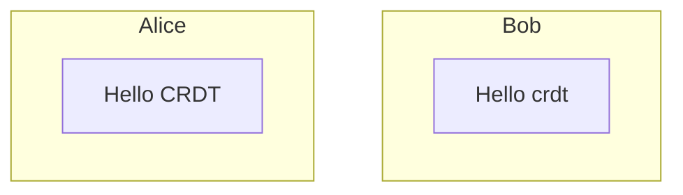
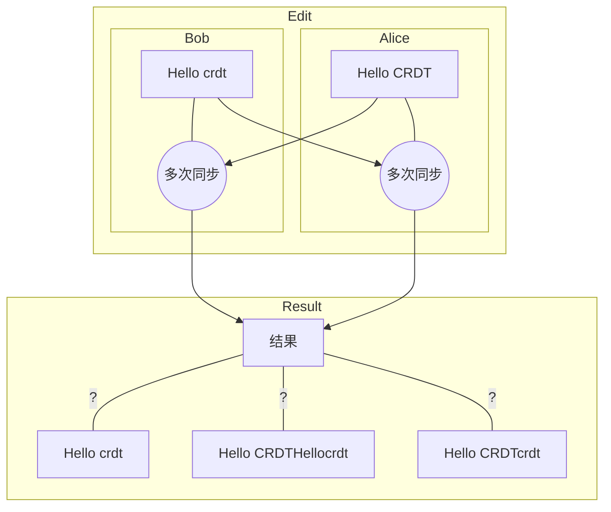

这篇博客将简要介绍[CRDTs](https://en.wikipedia.org/wiki/Conflict-free_replicated_data_type)（Conflict-free Replicated Data Types）的基本概念以及从开发者的角度着重介绍简单的CRDTs的实现（基于*RGA算法*）流程与细节，并且基于这些知识点实现一个rust+wasm的简单web文本协作demo。

- 项目地址: https://github.com/Leeeon233/crdt-toy
- demo地址: https://leonzhao.cn/crdt-toy

# 什么是CRDTs

对于CRDTs可以优先通过看[[CRDT简介](https://www.zxch3n.com/crdt-intro/crdt-intro/)]、[[CRDT原理](http://jtfmumm.com/blog/2015/11/17/crdt-primer-1-defanging-order-theory/)]这些文章了解。

CRDTs是近些年开始备受关注的一种用来处理分布式系统上的协同可用性的数据结构。它在`可用性`与`分区容错性`的基础上，不提供`完美的一致性`而是提供**`强最终一致性`**。下面的例子可以帮助我们理解什么是**强最终一致性**。

比如当前有**Alice**和**Bob**两个同学在各自的电脑上共同编辑同一份文档，Alice写入了`Hello CRDT`，Bob写入了`Hello crdt`。

但在此时Alice其实并没有办法知晓Bob可能在同一时刻也写入了`Hello crdt`的文本，而不是就像真正本地那样，完全意义上的在**编辑同一份文件**（一致性）。

只有当他们进行了一次同步通信后，Alice或者Bob才会知晓对方编辑了什么。crdt所提供的**强最终一致性**意义并不是让多人协同真正地像大家就在同一页纸上写字一样，而是大家可以各自地编辑自己的内容，尽管在多次同步的过程中会产生冲突，但crdt可以保证所有的消息都被接收后，**最终的内容**将会是多方一致的，哪怕可能最终冲突解决后的版本并不是真正所期待的结果。

对于Alice和Bob的例子，在输入`Hello CRDT`和`Hello crdt`时可能进行了多次的同步操作，最终展现在Alice和Bob眼前的文本根据不同的crdt算法和冲突解决策略可能变得不同。也许是`Hello crdt`、`Hello CRDTHellocrdt`或`Hello CRDTcrdt`等等都有可能，但是最终在Alice和Bob眼前的结果将会是完全一致的其中一种结果。

# 未完
