这篇博客将简要介绍[CRDTs](https://en.wikipedia.org/wiki/Conflict-free_replicated_data_type)（Conflict-free Replicated Data Types）的基本概念以及从开发者的角度着重介绍简单的 CRDTs 的实现流程与细节（基于*RGA 算法*），并且基于这些知识点实现一个 rust+wasm 的简单 web 文本协作 demo。

- 项目地址: https://github.com/Leeeon233/crdt-toy
- demo 地址: https://leonzhao.cn/crdt-toy

实现思路参考了 crdt-edit[^1]

<!--truncate-->

## 什么是 CRDTs

对于 CRDTs 可以优先通过看[[CRDT 简介[^2]](https://www.zxch3n.com/crdt-intro/crdt-intro/)]、[[CRDT 原理[^3]](http://jtfmumm.com/blog/2015/11/17/crdt-primer-1-defanging-order-theory/)]这些文章了解。

CRDTs 是近些年开始备受关注的一种用来处理分布式系统上的协同可用性的数据结构。它在`可用性`与`分区容错性`的基础上，不提供`完美的一致性`而是提供**`强最终一致性`**。下面的例子可以帮助我们理解什么是**强最终一致性**。

比如当前有**Alice**和**Bob**两个同学在各自的电脑上共同编辑同一份文档，Alice 写入了`Hello CRDT`，Bob 写入了`Hello crdt`。

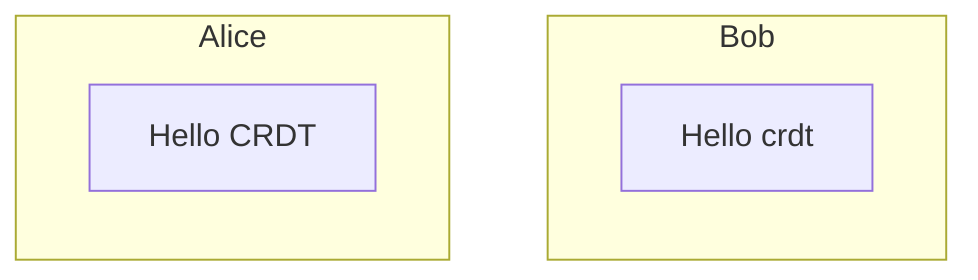

但在此时 Alice 其实并没有办法知晓 Bob 可能在同一时刻也写入了`Hello crdt`的文本，并不像真正本地那样，完全意义上的在**编辑同一份文件**（一致性）。

只有当他们进行了一次同步通信后，Alice 或者 Bob 才会知晓对方编辑了什么。crdt 所提供的**强最终一致性**意义并不是让多人协同真正地像大家就在同一页纸上写字一样，而是大家可以各自地编辑自己的内容，尽管在多次同步的过程中会产生冲突，但 crdt 可以保证所有的消息都被接收后，**最终的内容**将会是多方一致的，哪怕可能最终冲突解决后的版本并不是真正所期待的结果。

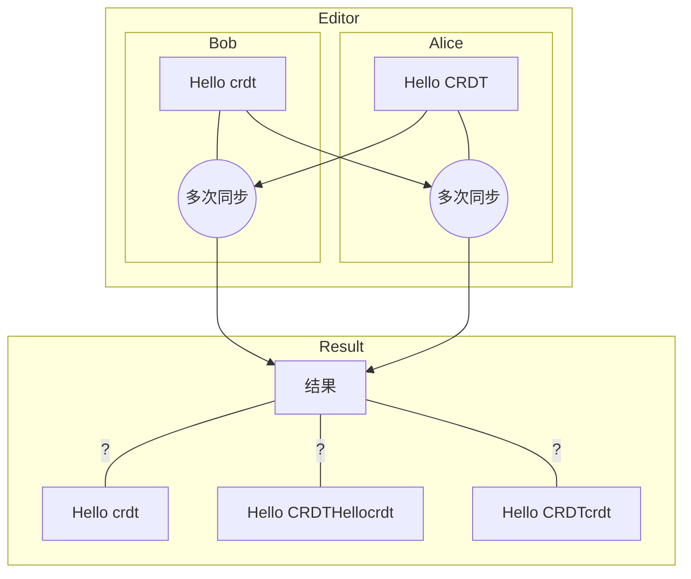

对于 Alice 和 Bob 的例子，在输入`Hello CRDT`和`Hello crdt`时可能进行了多次的同步操作，最终展现在 Alice 和 Bob 眼前的文本根据不同的 crdt 算法和冲突解决策略可能变得不同。也许是`Hello crdt`、`Hello CRDTHellocrdt`或`Hello CRDTcrdt`等等都有可能，但是最终在 Alice 和 Bob 眼前的结果将会是完全一致的其中一种结果。

## CRDTs 的简单实现

我们就以多人的文本内容协作作为场景来尝试实现一个基于 op 的 crdt 的编辑器。下面是编辑器 demo 的效果展示。分别有`Client1`和`Client2`两个客户端在共同编辑一份文档。
**Final Text**的文本区域展示的当前同步后的结果。`Client1`和`Client2`也可以点击按钮表示进行同步。

<iframe src={"https://leonzhao.cn/crdt-toy"} width={860} height={840} />

首先我们需要确定这样一个简单的编辑器，用户会有哪些操作(op)。思考一下，非常简单地就可以得出一共有两种操作：

- 插入
- 删除
- ~~修改~~（可以简单地视为先删除再插入的组合）

### 分布式中的顺序

那么我们还是回到 Alice 和 Bob 的例子，我们提供了第一版的编辑器给他们，但是由于我们技术还未成熟，要求他们只能插入内容还不能删除。Alice 和 Bob 同意参与到我们的迭代测试中去。他们还是分别一次输入了
`Hello CRDT`和`Hello crdt`。这时他们发起了同步。

Alice 给 Bob 打了个电话，发现自己的屏幕上结果是`Hello CRDTHello crdt`而 Bob 的屏幕上结果是`Hello crdtHello CRDT`。怎么会这样？他们把测试结果反馈给了我们。

原来我们第一版系统都把新接收到的**插入操作**当作了后发生的事情，Alice 的编辑器把 Bob 的内容加在了后面，Bob 的编辑器也是如此。这和我们一开始所强调的**强最终一致性**可不符。我们希望无论事件被怎样创建和接收，只要操作集合是一致的，那么最终结果应该一样。

既然已经知道了问题所在，那么就没什么问题了。我们只需要让每个用户之间有一个固定的顺序就可以了，可以为每一个编辑器客户端分配一个`Client ID`，以**ID**的大小顺序来作为操作的顺序。我们很快发布了 v2.0 版本，让客户端 ID 越大认为操作越先发生，并且分配

- Alice 的客户端版本为`1`
- Bob 的客户端版本为`2`

提供给了 Alice 和 Bob 帮忙测试使用。

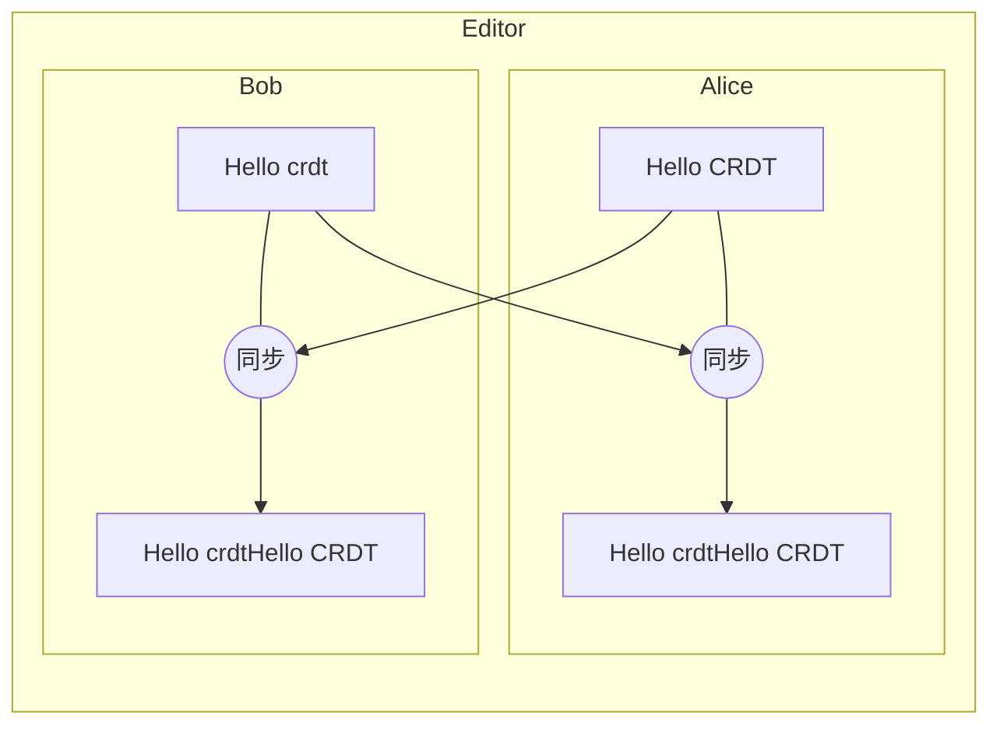

这回没有问题了，Alice 和 Bob 的编辑器上显示的都是`Hello crdtHello CRDT`文本。

但随着进一步使用，Alice 和 Bob 又发现问题了。这次

- Bob 先输入了`one `然后又输入了`two`
- Alice 先输入了`three `又输入了`four`

然后他们进行了同步，这次每个人都**发送了两个插入操作**。

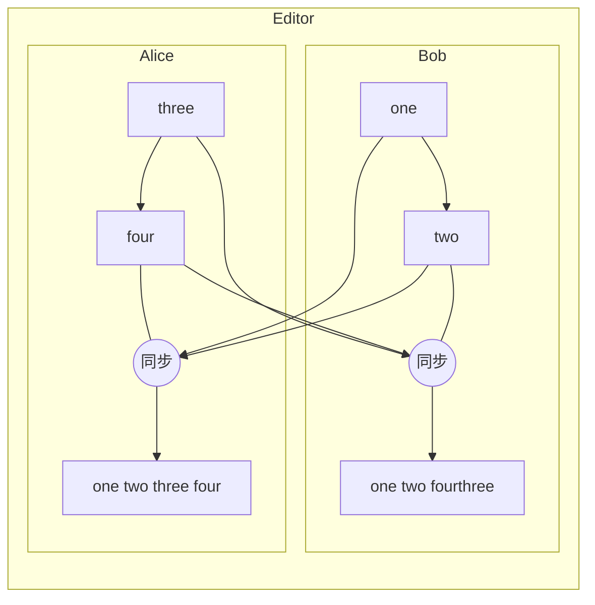

现在 Bob 的屏幕上显示的是`one two fourthree `而 Alice 屏幕上显示的却是`one two three four`，正常来说`one two three four`才是他们想要的结果。

我们发现 Alice 向 Bob 同步的内容发生了顺序的改变，有着分布式经验的我们立刻想到，可能是网络延迟的原因，导致 Alice 的第二个操作早于第一个操作被 Bob 的客户端接收到造成了顺序的不一致。

既然已经知道了问题所在，那么就没什么问题了。我们可以新增一个逻辑时间戳，也就是[Lamport Timestamp](https://en.wikipedia.org/wiki/Lamport_timestamp)

> Lamport Timestamp 的算法很简单[^4]
>
> - 每个进程维护一个`counter`
> - 本地每发生一个事件就将`counter + 1`，并将事件的时间戳设置为`counter`值
> - 每当进程发送一个消息，就将本地`counter + 1`，并将最新的`counter`值附带在消息上
> - 当进程收到消息后，让自己的`counter = max(counter, message.counter) + 1`

我们在原有的`ClientId`基础上进行了扩展，构建了一个`EventId`，其中包括了`ClientId`和`Lamport Timestamp`两部分，这样事件的发生顺序就可以与接收到的顺序无关了。

我们抓紧更新了 v3.0 版本的编辑器给到 Alice 和 Bob，心想肯定没问题了。

### 只确定逻辑顺序就够了吗

Alice 和 Bob 拿到 v3.0 的编辑器那肯定先尝试了一下刚刚失败的例子

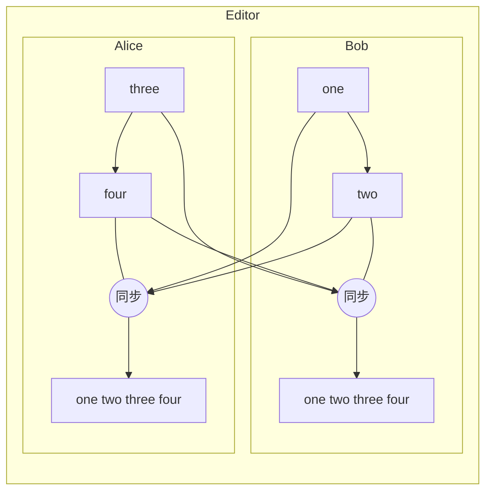

果然更新后就没问题了。但 Bob 这回想着也不能一直只在后面加字符，于是 Bob 在编辑器的最前面插入了`zero `，并且同步给了 Alice。发现同步之后结果怎么又不一样了。Alice 的结果是`one two three fourzero `，Bob 输入的`zero `怎么在后面啊？

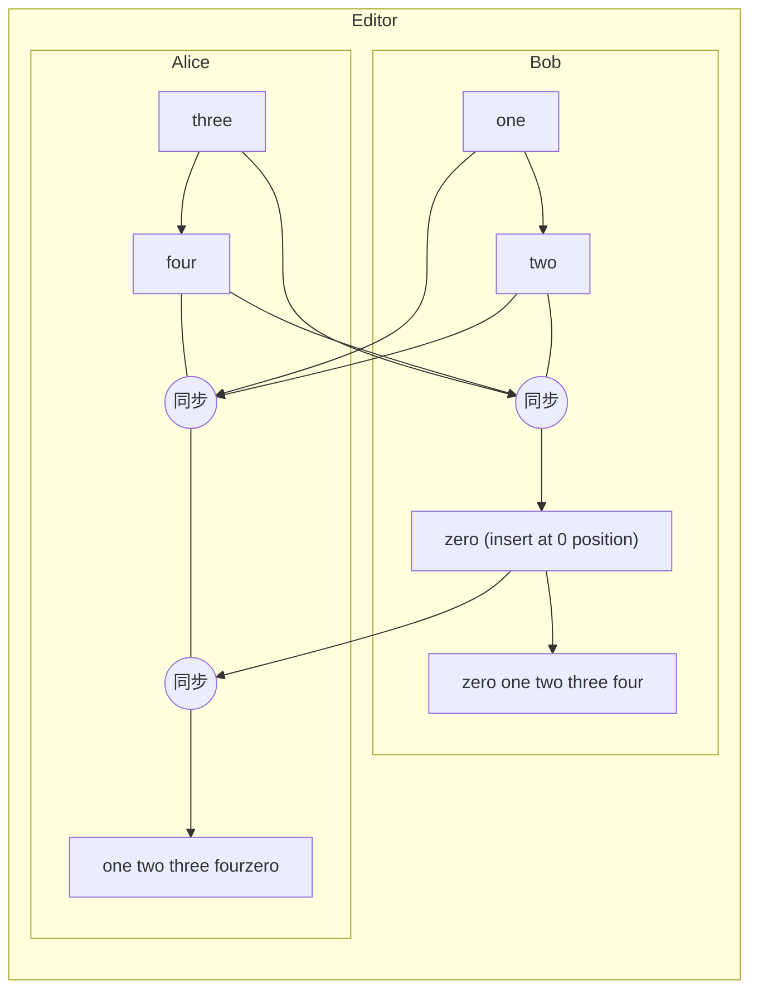

Alice 和 Bob 开始不耐烦了起来，你们这个编辑器到底行不行？我们听到这个消息，赶快赶过来了解情况。

之前我们给每个插入操作分配了一个`EventId`，能够确定所有的插入操作的发生顺序。但是我们没有想到操作的顺序在文本这个场景下不能代表操作的位置。我们觉得不能再这样遇到什么问题解决什么问题了，需要好好想清楚编辑器这个问题，包括一直没被考虑的**删除**操作。

目前我们一共面临下面几个问题：

- 文本的插入和删除操作是需要确定插入和删除位置的，该如何确定
- 文本可能在任意的位置进行插入和删除，我们应该需要确定操作的最小单位
- 简单的 Op 列表可能不太容易满足我们的要求了，该使用怎样的数据结构呢

面临的问题还有些抽象，我们先通过一部分的例子来模拟一下吧。

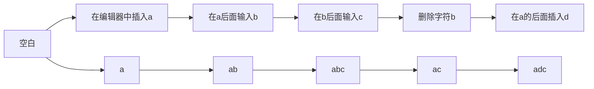

看到上面的图，我们的思路就清晰了很多。文本编辑里面最小操作的单位肯定是**`字符`**这点毋庸置疑了。至于确定位置这点，我们观察图中第一排的全部操作描述

- 在编辑器中插入 a
- 在 a 后面输入 b
- 在 b 后面输入 c
- 删除字符 b
- 在 a 后面插入 d

那么位置就完全可以通过当前文本内容，看接下来要插入或者删除的字符是*基于*目前文本的哪个字符做的操作就可以确定了。这样不同的字符之间好像就有了依赖关系，那数据结构是不是可以使用树形结构了？

我们突然感觉灵感来了。

### 文本编辑好像就是棵树

如果我们把初始空文本当作树的根节点（root）的话，那么插入字符`a`就是`a`是`root`的子节点。在`a`后面插入`b`，那`b`就是`a`的子节点。我们把上面的示例画一下：

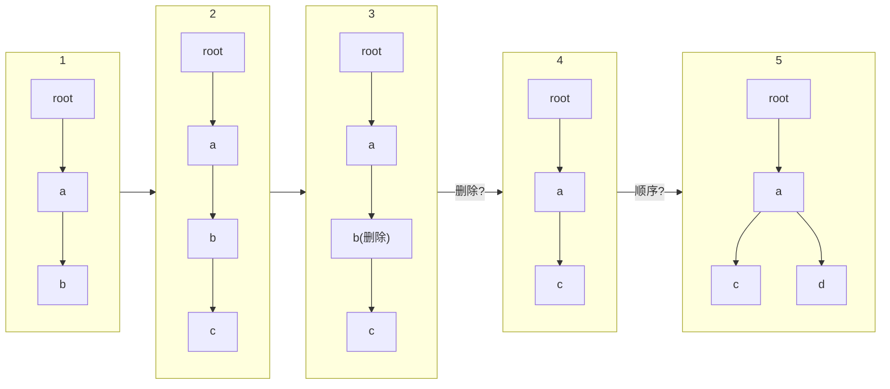

把输入字符的过程可视化之后，我们看到过程 1 和 2 好像都没什么问题，全部都是在按顺序插入字符，前一个字符作为后一个字符的父节点，从根节点遍历下来就能还原原始文档。但是接下来我们好像遇到两个不是太明朗的操作。

- 多个子节点时遍历顺序是否有要求
- 删除字符时是否要把节点删除

这回实在不好意思再请 Alice 和 Bob 帮我们找问题了，就我和你来自己先多测测吧。第一个问题看起来还算简单

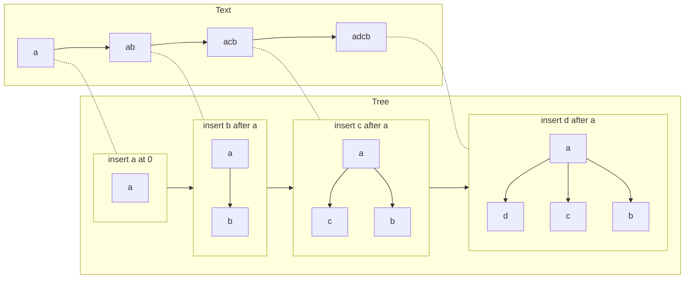

我们不断模拟向`a`后面加入文本，结果都是越后面加入的字符，越显示在前面。在前面测试分布式同步的时候我们已经可以通过`EventId`全局地确定顺序了，那么全部子节点的顺序就可以通过`EventId`进行排序，越*新*的`EventId`将在子节点中越早被遍历。

### 删除了字符，它就不存在了吗？

接着我们模拟了几次协作时删除字符的情况，比如这次我先输入了`ab`你输入了`c`，之后我们进行了一次同步，我们的结果最后都是`abc`。

你可能会有疑问，为什么是<code>abc</code>，而不是<code>cab</code>？

这里我们使用假设

- 你的`ClientId`是`1`
- 我的`ClientId`是`2`
- `ClientId`越大 crdt 认为越先发生

我们详细看一下`abc`的合并过程，现在我收到了全部的 crdts 的 op：

1. 根节点插入 `a` EventId(counter: 0, client_id: 2)
2. `a` 节点插入 `b` EventId(counter: 1, client_id: 2)
3. 根节点插入 `c` EventId(counter: 0, client_id: 1)

根据刚刚的结论，op1 和 op3 都是`counter`为 0 的 op，但是 op1 的`ClientId`更大，在假设前提下会被认为优先发生。那么整个 op 顺序就会变成 132，即结果的`abc`。

紧接着我删除了`b`，而你在`b`的后面输入了`d`，然后我们都发起了同步请求。

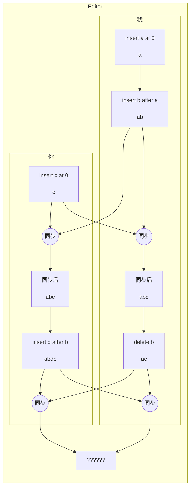

现在好像遇到了问题，我都已经把`b`删掉了，那么该怎么同步你要把`d`插入在`b`后面的操作呢？

我静静地整理了一下思路，我删除了`b`，但于此同时的你或者其他人仍可能在`b`后面输入一些字符，这也就是`b`仍可能是其他子树的父节点。其他节点仍然可能会依赖于它。所以我们在删除操作时不可能将真正的树节点删除。

再来想想文本展示时，就是一个树的遍历过程。只要不在编辑器上显示这个字符那么使用编辑器的用户就完全可以认为这个字符被删除了。所以我们只需要给每个节点增加一个`标志`，表示这个节点是不是被删除就可以了。

:::tip

上面提到的为了保留树的完整结构，不删除节点，而是添加标志的方式就是一种[墓碑机制](https://baike.baidu.com/item/%E5%A2%93%E7%A2%91%E6%9C%BA%E5%88%B6/7558924)

:::

现在我们编辑器的结果就都会是`adc`，满足 crdts 所要求的`强最终一致性`。我们来遍历一遍刚刚所形成的文本树：

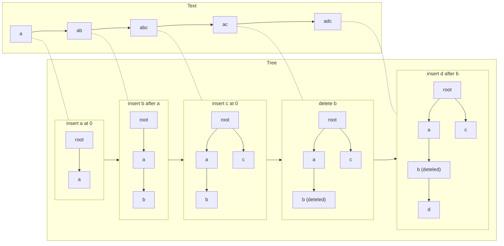

## CRDTs 能够达成多人的操作协同，那么代价呢？

我们把最终的 v0.4 版本编辑器给到了 Alice 和 Bob，Alice 和 Bob 会有什么反馈呢？

我们来等待下一篇，看看 Alice 和 Bob 会不会有什么抱怨。

## 参考资料

[^1]: https://github.com/wangdashuaihenshuai/crdt-edit
[^2]: [CRDT 简介](https://www.zxch3n.com/crdt-intro/crdt-intro/)
[^3]: [A CRDT Primer Part I: Defanging Order Theory](http://jtfmumm.com/blog/2015/11/17/crdt-primer-1-defanging-order-theory/)
[^4]: [如何设计 CRDT 算法-Zxch3n](https://www.zxch3n.com/crdt-intro/design-crdt)
